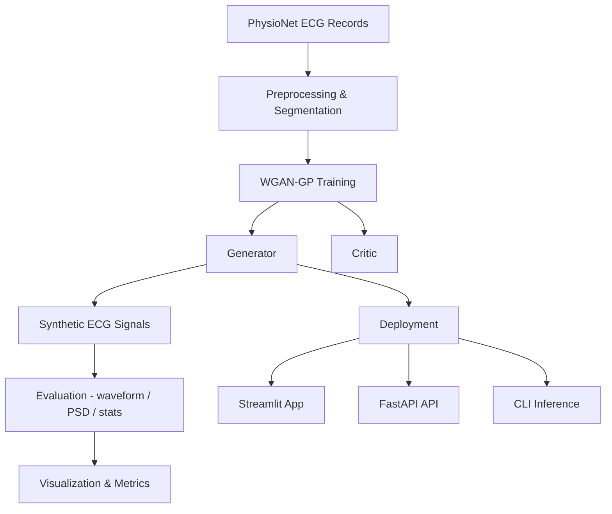
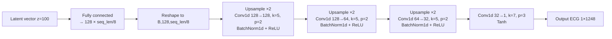
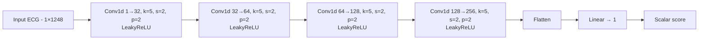

# 🫀 Synthetic ECG Signal Generation using WGAN-GP

A complete end-to-end system that leverages **Wasserstein GAN with Gradient Penalty (WGAN-GP)** to generate realistic 1‑D ECG heart‑beat signals from PhysioNet data. The synthetic waveforms can help mitigate **data scarcity, class imbalance, and privacy concerns** in cardiac signal analysis.

This repository contains everything required to **load/preprocess ECG records, train a WGAN‑GP, produce synthetic signals, evaluate generative quality, and deploy the model via CLI, web UI & REST API**.

---


## 🚀 Setup

1. **Clone the repository** and navigate to the project directory.
2. **Create and activate a Python environment**:
    ```bash
    python -m venv venv
    source venv/bin/activate
    ```
3. **Install dependencies**:
    ```bash
    pip install -r requirements.txt
    ```
4. **Prepare the data**:
    - Download the MIT-BIH PhysioNet dataset (using WFDB or PhysioNet tools).
    - Place all `.hea` and `.atr` files in `Rawdata/Physionet/`.
5. **Configure experiment settings** in `configs/default.yaml` as needed.

---

## �📌 Why this project?

Cardiac arrhythmia detection and other ECG‑based diagnostics rely on large labeled datasets. However:

- Public ECG databases are limited in size and may not cover rare conditions.
- Clinical data sharing is restricted by privacy and patient consent.
- Many studies suffer from **class imbalance** (e.g. fewer abnormal beats).

Traditional signal augmentation (noise injection, scaling, time‑stretch) cannot capture the complex morphological variations of ECG waveforms. A generative model offers a way to **synthesize diverse realistic heartbeats** that respect physiological constraints.

**Core question:** *Can a WGAN‑GP trained on PhysioNet recordings produce plausible ECG segments suitable for downstream tasks?*

---

## 🧭 What does this project do?

- Reads and preprocesses MIT‑BIH PhysioNet ECG records
- Trains a **1‑D WGAN‑GP** to model sampled 1248‑point ECG segments
- Generates synthetic ECG signals in unlimited quantity
- Evaluates quality using waveform comparison, spectral statistics, and simple metrics
- Deploys the trained generator via:
  - Command‑line inference script (`inference/generate.py`)
  - **Streamlit** web interface (`deployment/streamlit_app.py`)
  - **FastAPI** REST service (`deployment/api.py`)

---

## 🧠 System Overview

```text
PhysioNet ECG Records
          ↓
Preprocessing (filter, normalize, segment)
          ↓
WGAN-GP Training (1‑D signals)
          ↓
Synthetic ECG Segments
          ↓
Evaluation (waveform, PSD, stats)
          ↓
Deployment & Inference
``` 

---

## 📁 Repository Structure

```text
Project4/
├── configs/              # YAML default settings (data & training)
├── data/                 # loaders and preprocessing routines
├── experiments/          # training runs, checkpoints and logs
├── generated_data/       # saved synthetic signals (.npy)
├── inference/            # CLI generation script
├── deployment/           # Streamlit app & FastAPI server
├── evaluation/           # analysis scripts
├── models/               # Generator & Critic architectures
├── training/             # WGAN-GP trainer & utilities
├── monitoring/           # experiment manager and logger
├── Rawdata/              # original PhysioNet files (not tracked)
├── train_gan.py          # entrypoint for training
├── train_classifier.py   # placeholder classifier script
├── README.md             # <— this file
└── requirements.txt
```

> **Note:** Large ECG files, checkpoints, and generated signals are excluded via `.gitignore`.

---

## 🏗️ Architecture Flow



---


---

## 🧩 Modules & Design

### I. 📦 Data Pipeline & Preprocessing

Signals are loaded from MIT‑BIH PhysioNet (`Rawdata/Physionet`) using `wfdb`. Each record is:

1. Filtered with a 0.5–40 Hz bandpass
2. Normalized (zero mean, unit variance)
3. Segmented into non‑overlapping windows of length **1248 samples** (≈3.5 s at 360 Hz)

Scripts:
- `data/physionet_loader.py` – load and segment records
- `data/preprocess.py` – filtering, normalization, length enforcement
- `data/dataset.py` – PyTorch Dataset wrapper


**Configurable parameters:**  Edit `configs/default.yaml` for `seq_len`, `sampling_rate`, `lowcut`, `highcut`, and `lead_index`.

---


### II. 🧩 Model Architecture

A compact 1‑D WGAN‑GP models ECG waveforms. The two core network architectures are visualized below. See `models/generator.py` and `models/critic.py` for implementation.

#### Generator (G)



- **Input:** latent vector `z ∈ ℝ^{100}` sampled from N(0,1)
- FC layer projects to `(128, seq_len/8)`
- Three upsampling blocks with Conv1D, BatchNorm, ReLU
- Final Conv1D + Tanh produces `(1, 1248)` waveform

#### Critic (C)



- Four strided Conv1D layers with LeakyReLU
- Flatten followed by a linear output scalar

These architectures are defined in `models/generator.py` and `models/critic.py`.

---


### III. 🔁 Training

**Main script:** `train_gan.py`  
**Trainer:** `training/wgan_trainer.py` (WGAN-GP logic)

#### Command

```bash
python train_gan.py
```

> **Note:** a `train_classifier.py` script is included as a stub for downstream classification experiments. It is not required for GAN training but can be adapted if you wish to combine synthetic ECGs with a classifier pipeline.

#### Key hyperparameters (`configs/default.yaml`):

- `batch_size`: 64
- `epochs`: (set as needed)
- `lr`: 1e-4
- `n_critic`: 5 (critic updates per generator update)
- `gp_lambda`: 10.0 (gradient penalty)

#### Training loop

1. Sample real ECG batch
2. For `n_critic` steps:
     - Generate fake ECGs from random $z$
     - Compute critic scores on real and fake
     - Compute gradient penalty and critic loss
     - Update critic
3. Update generator using negative critic score

#### Logging & Checkpoints

- **ExperimentManager** (`monitoring/experiment_manager.py`) creates a timestamped folder in `experiments/`, saves config, logs, checkpoints, and metrics.
- **Logger** (`monitoring/logger.py`) writes to both console and `logs/train.log`.
- **Checkpoints:**  
    - `experiments/<exp_id>/checkpoints/best_model.pt` (lowest generator loss)
    - `experiments/<exp_id>/checkpoints/last_model.pt`
- **Metrics:**  
    - `experiments/<exp_id>/metrics.json` (loss history)

---


### IV. 🧪 Evaluation

**Script:** `evaluation/evaluate.py`

#### Command

```bash
python evaluation/evaluate.py
```

#### What it does

- Loads real and generated ECGs
- Computes and saves:
    - Mean and standard deviation
    - Waveform overlay plots
    - Power spectral density (Welch)
    - Spectral MSE and high-frequency energy
- Outputs saved in `evaluation_results/<experiment_id>/`

> **Classifier evaluation:** If you extend the project with a classifier, use `train_classifier.py` and refer to `evaluation/evaluate.py` for adding classification metrics.

---


### V. 🚀 Deployment & Inference

#### 🖥️ Streamlit Web App

**Script:** `deployment/streamlit_app.py`

**Command:**
```bash
streamlit run deployment/streamlit_app.py
```

- Select number of ECG samples to generate
- View plotted waveforms
- Download generated `.npy` file

---

#### 🌐 REST API (FastAPI)

**Script:** `deployment/api.py`

**Command:**
```bash
uvicorn deployment.api:app --reload
```

- `GET /` – health check
- `GET /generate?n_samples=5` – returns JSON with ECG arrays

---

#### 🧪 CLI Generation

**Script:** `inference/generate.py`

**Command:**
```bash
python inference/generate.py
```

- Generates and saves ECGs to `generated_data/generated_ecg_2000.npy`
- Plots samples for quick inspection

---


### VI. 📈 Monitoring & Logging

- **ExperimentManager**: Handles experiment folders, config, metrics, and checkpoints. Each run is self-contained in `experiments/exp_<timestamp>/`.
- **Logger**: Console and file logging for all training events.
- **All runs are reproducible**: Each experiment is self-contained and can be compared or restored independently.

---

## ⚠️ Limitations

- Model produces **unconditional** ECG segments; there is no control over heart rate or rhythm.
- Only single-lead (lead I) signals are modeled at **1248‑sample resolution**.
- Realism is assessed via simple statistics; advanced metrics such as FID or clinical validation are not included.
- Training is demonstrated with low epoch count; for production, extend epochs and dataset size.

---

## 🔮 Future Work & Extensions

- Extend to **conditional GAN** (e.g., specify arrhythmia type or heart rate)
- Use **StyleGAN** or higher‑capacity architectures for longer / multi‑lead signals
- Incorporate **classifiers** to pseudo‑label and augment downstream arrhythmia detection
- Implement **quantitative GAN metrics** (FID, MMD, clinical expert evaluation)

---


## 👥 Team

<table>
  <tr>
      <td align="center">
      <a href="https://github.com/ishitachowdary">
        
        <br />
        <sub><b>Ishitha Chowdary</b></sub>
      </a>
      <br />
    </td>
    <td align="center">
      <a href="https://github.com/LaxmiVarshithaCH">
        
        <br />
        <sub><b>Chennupalli Laxmi Varshitha</b></sub>
      </a>
      <br />
    </td>
    <td align="center">
      <a href="https://github.com/Jhansi652">
        
        <br />
        <sub><b>Y. Jhansi</b></sub>
      </a>
      <br />
    </td>
      <td align="center">
      <a href="https://github.com/2300033338">
        
        <br />
        <sub><b>V. Swarna Blessy</b></sub>
      </a>
      <br />
    </td>
      <td align="center">
      <a href="https://github.com/2300030435">
        
        <br />
        <sub><b>MD. Muskan</b></sub>
      </a>
      <br />
    </td>
      <td align="center">
      <a href="https://github.com/likhil2300030419">
        
        <br />
        <sub><b>Likhil Sir Sai</b></sub>
      </a>
      <br />
    </td>
  </tr>
</table>

---

## 📬 Feedback & Contributions

- Open issues for bugs, questions, or feature requests
- Submit pull requests for improvements or new features
- Discussion and collaboration are welcome!

---

*This README was generated with reference to your codebase and best open-source practices. Update as your project evolves!*
